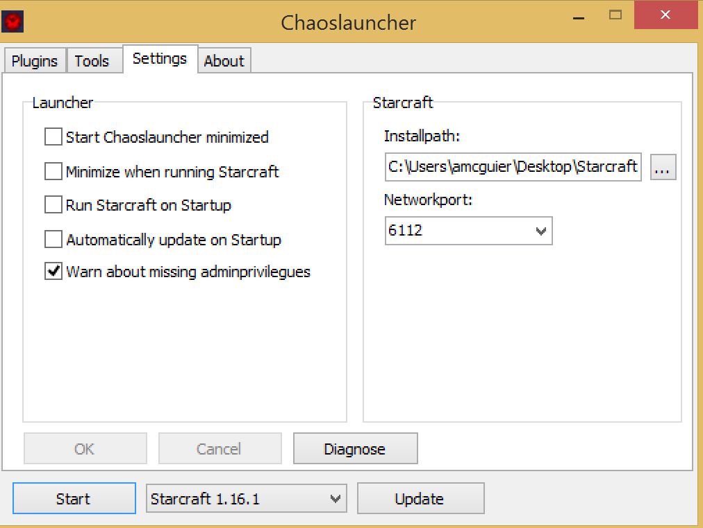
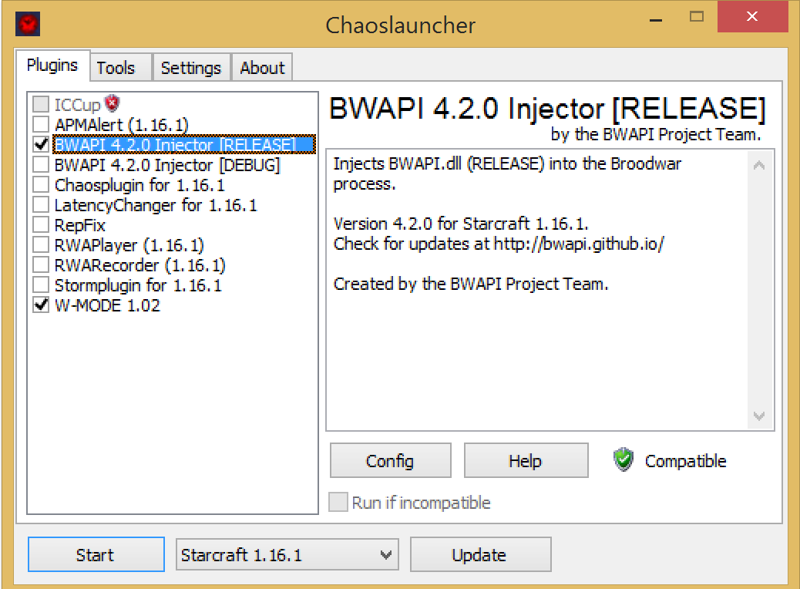

# Bot Setup Instructions

1. Download the broodwar zip and extract it to your files personal drive (mine is C:\Users\<YourUserName>)

    *Note When you extract, remove the `\Starcraft\` from the end of the path or it'll end up nested*
2. Copy the resulting starcraft file to "my files" (W:\)

    *Note this will take a few minutes, sorry, the shared drives are slow*
3. Open powershell
4. Type:
   `cd "W:\Starcraft\cybw\"` 
   
    assuming you extracted starcraft to the top level of your shared drive
5.  Type:
    `.\venv\cybw\Scripts\activate.ps1`
6.  At this point you should see (cybw) at the begining of the command prompt, if not, ask for help
7. Type:
   `python --version` it should print `Python 3.5.3` if you don't see this, ask for help
8. Type:
    `python  .\example_ai\example.py`
    

# Starcraft First Time Setup

1. Open the folder where you unzipped Starcraft in file explorer
2. Go to the ChaosLauncher folder
3. Run ChaosLauncher, when prompted you can uncheck "Always ask me before running this file"

    *Note this will take a second, slow drives again* 
4. Dismiss the popup about "Incorrect path to starcraft"   
5. Navigate to the settings tab 
6. Change the installpath to wherever you have starcraft
   
    By default this will be *W:/Starcraft/Brood War/*
7. Click `OK`
8. You should be prompted to restart the Chaos Launcher, in either case, restart it.
9. Go to the plugin tab
10. Enable 

    ```
    BWAPI 4.2.0 Injector [Release]
    W-Mode 1.0.2
    ```
   
   The former will setup the game to allow your bot to run, the latter will run the game 
   in a window so you don't have to live with the glories of 800x600 resolution
   
11. Click `Start`
    
    *Note: You can ignore the prompt about needing administrative permissions*
# Running the game
1. Go to the ChaosLauncher folder
2. Run ChaosLauncher
3. Click `Start`
4. The game is scripted to start automatically against a random opponent


# Pybrood documentation

<https://pybrood.readthedocs.io/en/latest/index.html>
